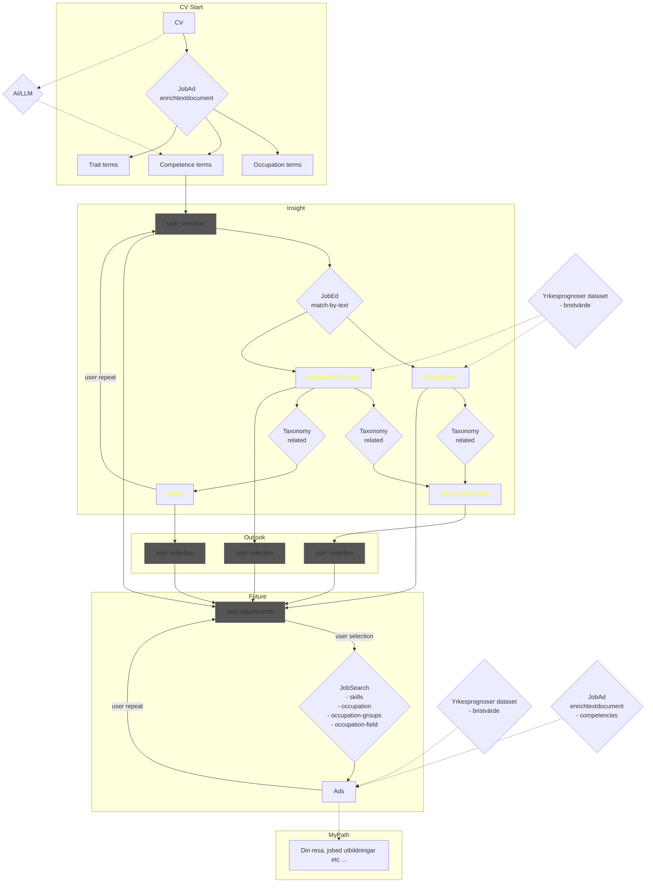

# Digital Yrkesvägledning

Research proof-of-concepts within a Swedish [research project](https://www.vinnova.se/p/pilot-digital-infrastruktur-kll/), funded by Sweden's innovation agency, looking at existing and future needs for data and service surrounding digital career counseling.

This repo is managed by RISE Reseatch Insititutes of Sweden, area of Lifelong Learning, contact [@ollenyman].

## First scenario iteration
Starts with a job ad and identifies a persons competence gap. Tabled because of Arbetsförmedlingen's analysis.

## Second scenario iteration
Starts with a CV, extracts keywords and lets the user guide towards job ad or education. As work progresses, more inputs into the process are expected - using AF Atlas taxonomy's relationship graph, using ChatGPT-style queries for widening the search for keywords, etc.
Initial implementation using the [competence-hub repo](https://github.com/LearningArena/competence-hub) (vagledning branch) as testbed.  
Current data sources usage:

<!-- Last mermaid letter: AC -->

## Glossary
- Sveriges referensram för kvalifikationer (SeQF)
- Standard för svensk yrkesklassificering (SSYK2012)
- Svensk utbildningsnomenklatur (SUN)
- Standard för svensk näringsgrensindelning (SNI)
- Europeiska klassificering av färdigheter, kvalifikationer och yrken (ESCO)
